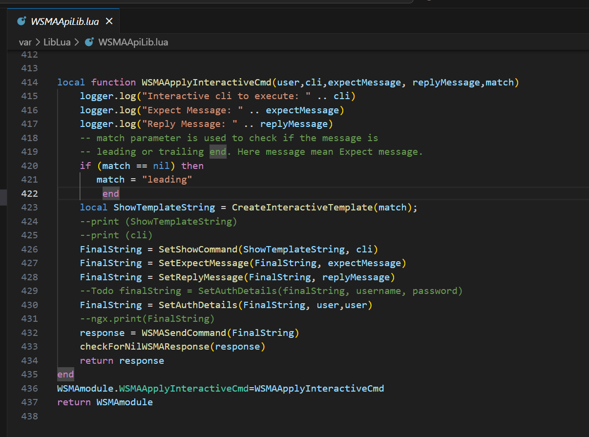
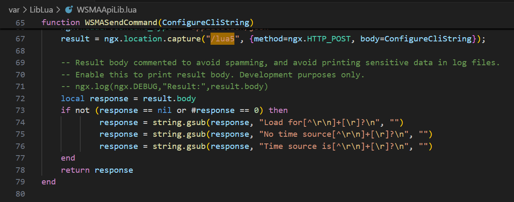
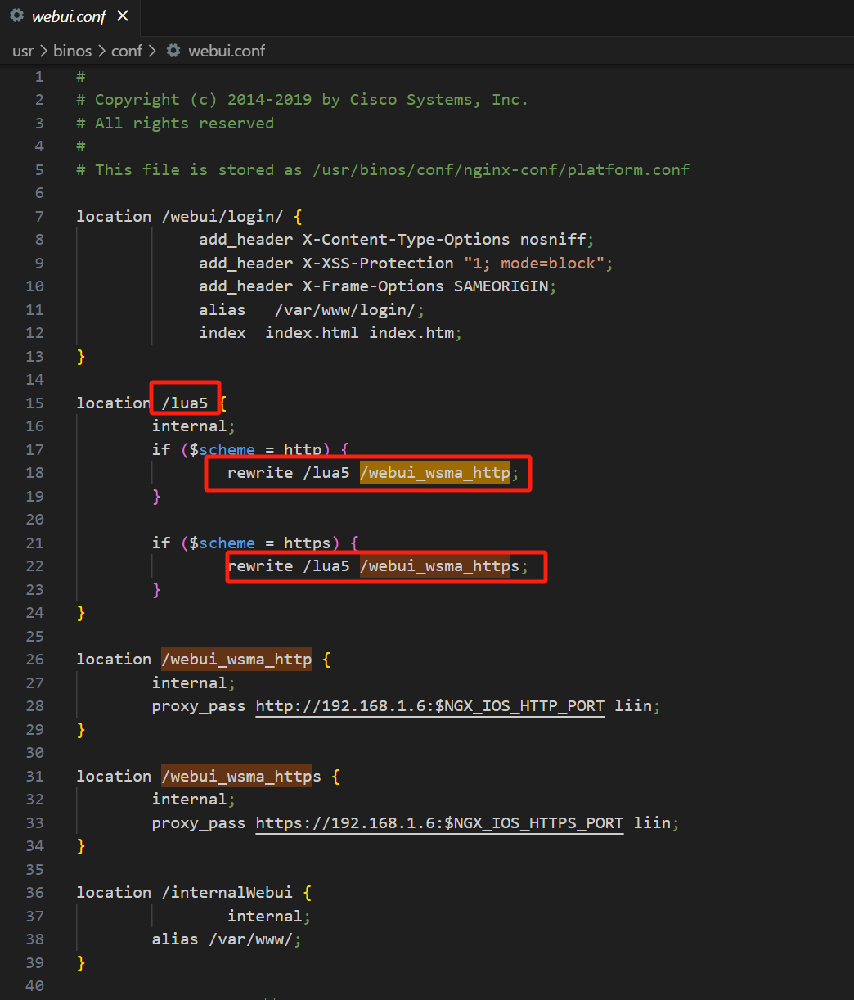
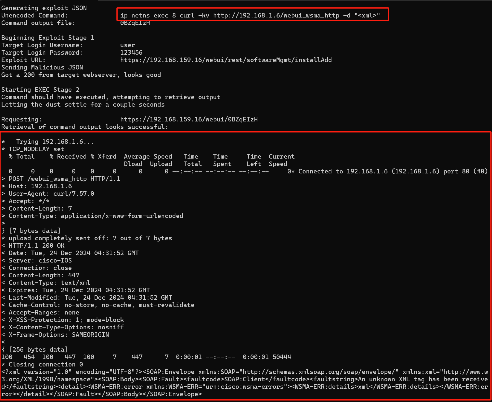
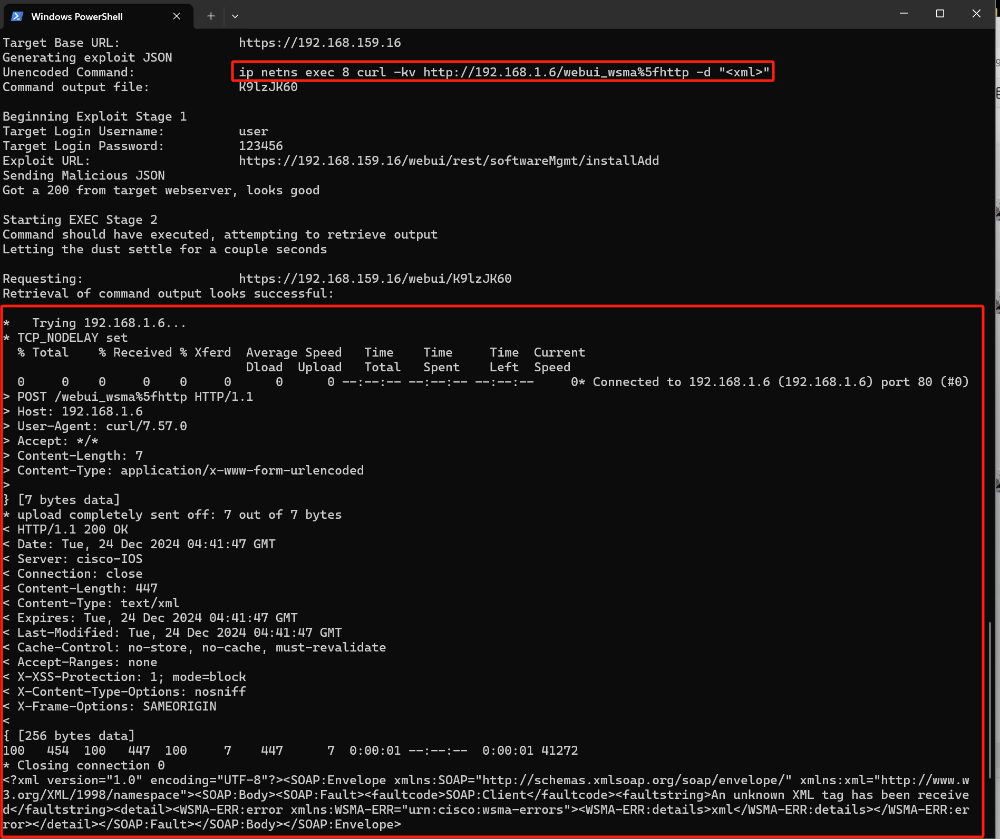
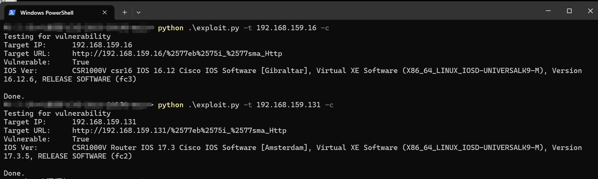

# 漏洞描述

未经身份验证的远程攻击者可以利用该漏洞创建具有最高访问权限的账户，进而控制受影响的系统。启用了Web UI功能的Cisco IOS XE设备均受该漏洞影响。

# 漏洞分析

首先，通过审计`/var/LibLua/WSMAApiLib.lua`可以发现，要执行CLI代码，最终都是通过访问`/lua`路径来实现的。




继续审计nginx的配置，该路径配置了`internal`字段，所以只能通过nginx内部代码来访问该路径。接着看代码，可以发现，`/lua`路径最终会根据`http`或者`https`来选择访问`/webui_wsma_http(s)` 路径，同样，该路径也是没办法通过外部访问，这部分nginx配置理论上无法绕过。


不过，`/webui_wsma_http(s)`路径也不是最终执行CLI命令的地方，最终是通过访问`http(s)://192.168.1.6`来与`iosd`程序进行通信，下面进行一个测试。
```bash
ip netns exec 8 curl -kv http://192.168.1.6/webui_wsma_http -d "<xml>"
```


```bash
ip netns exec 8 curl -kv http://192.168.1.6/webui_wsma%5fhttp -d "<xml>"
```



> 注：
> 
> 这里绕过nginx，从内部访问后端的IP地址，借助了CVE-2023-20273进行了命令执行

从上面可以发现，`iosd`能够进行URL decode。

想要执行CLI命令，需要直接访问`http://host/webui_wsma_http`来请求到`192.168.1.6`后端，由于设置了`internal`关键字，所以直接外部访问会返回404。

然而nginx默认情况下，会把请求发送给`iosd`后端且nginx服务是会对URL编码进行解码的。这样可以使用二次URL编码绕过这个nginx的内部网络限制，从而在外部进行命令执行。

# 漏洞利用

执行脚本，漏洞利用成功


