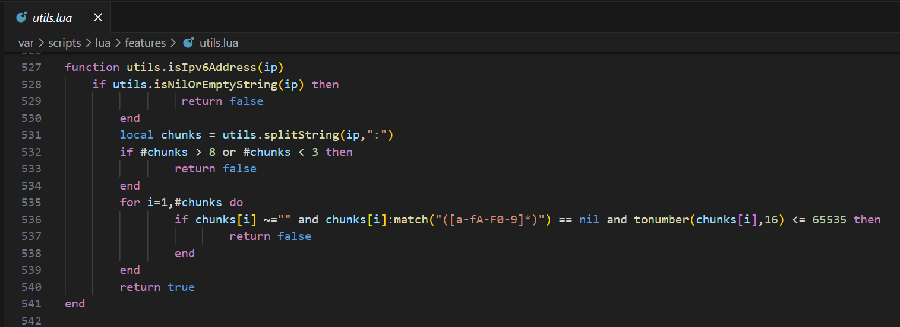
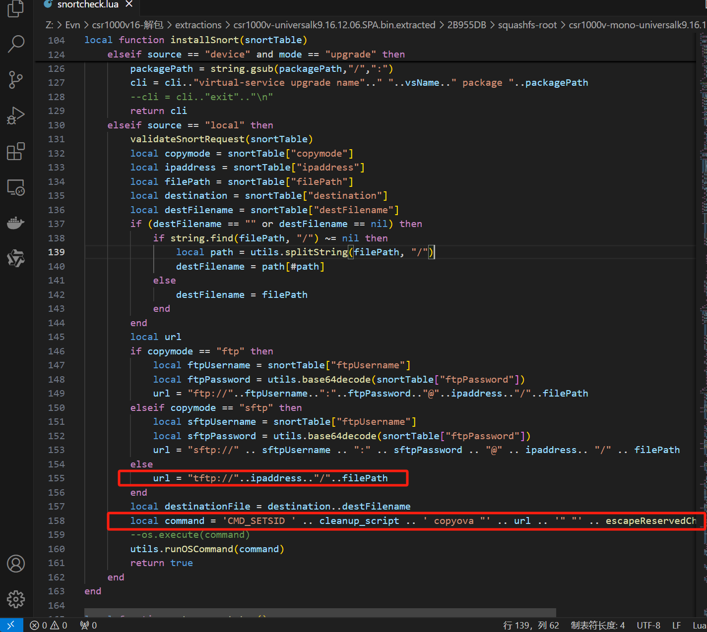
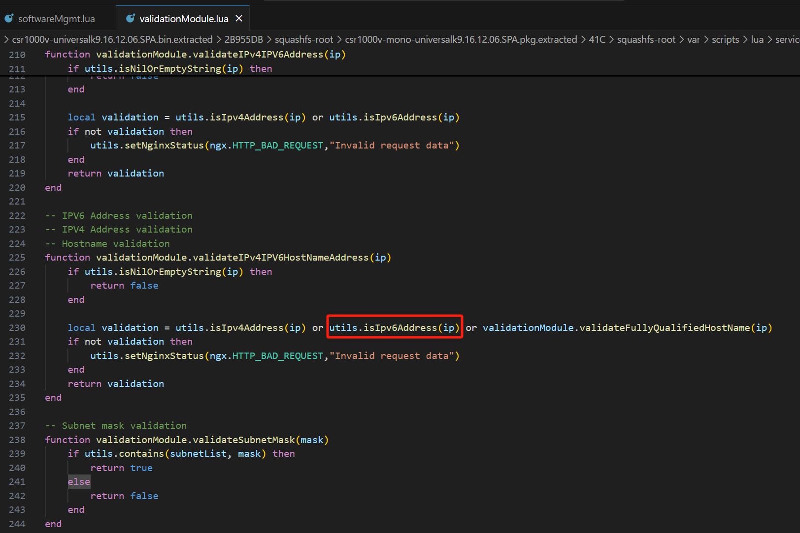
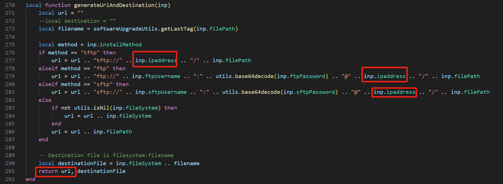
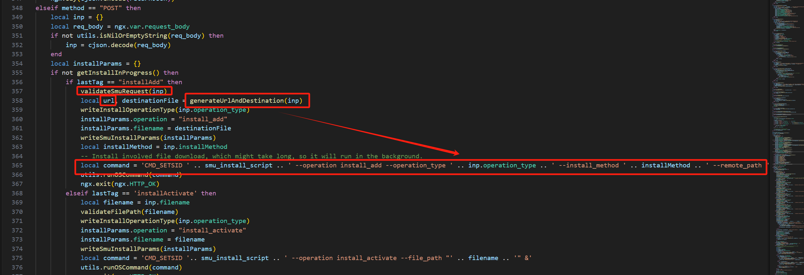
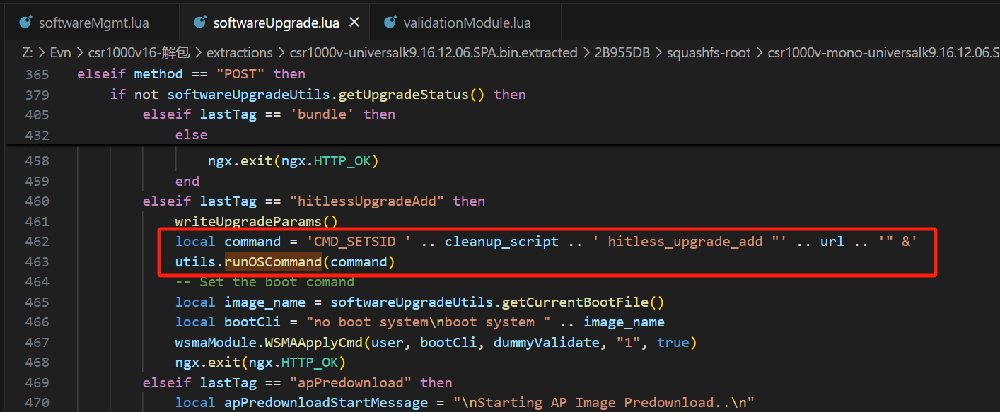
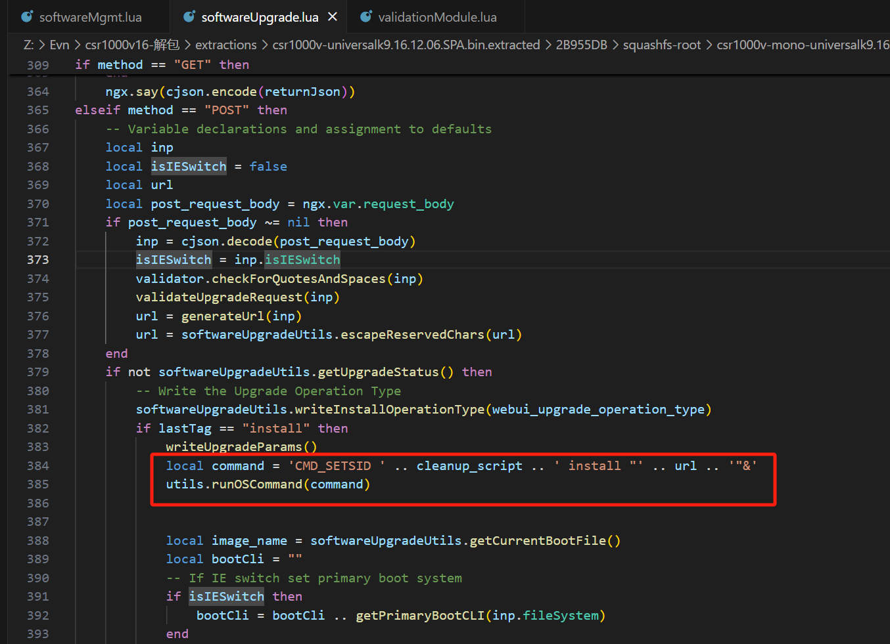
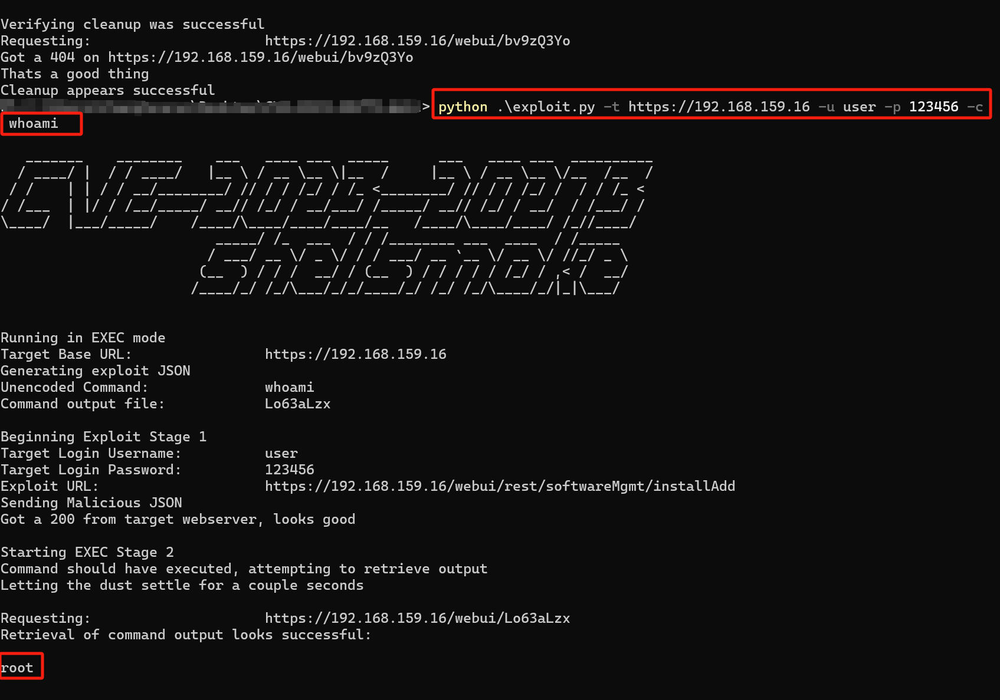

# 漏洞描述

思科IOS XE软件的Web UI功能存在漏洞，经过身份验证的远程攻击者可以利用此漏洞注入具有root特权的命令。此漏洞是由于输入验证不充分导致的。攻击者可以通过发送精心构造的输入利用此漏洞。成功利用此漏洞可使攻击者注入命令到底层操作系统并获得root特权。

# 影响版本

+ 16.12 ~ 16.12.10a

+ 17.3 ~ 17.3.8a

+ 17.6 ~ 17.6.6a

# 漏洞分析

先进行固件解包
```bash
binwalk -Me
```

在/var/scripts/lua/features/utils.lua文件中，IPv6的验证函数出现了问题。


正则`chunks[i]:match("([a-fA-F0-9]*)")`没有限制结束字符，也就是说只要构造的字符串开头部分能成功匹配正则。

## 命令注入点：
###  snortcheck.lua
在`validateSnortRequest`函数中会对`ipaddress`进行检查，但是因为能绕过IPv6的检查，所以这里可以导致命令注入。


> 备注：
>  
> 在IOS-XE中，17版本的命令执行函数是runPexecCommand
### softwareMgmt.lua
在`validateSmuRequest`中会对`ipaddress`进行检查


随后会在`generateUrlAndDestination`中拼接到`url`当中，最后导致命令注入




### softwareUpgrade.lua
在该文件中有两处命令注入漏洞，漏洞成因同上




# 漏洞利用

执行脚本，漏洞利用成功

[github上的利用脚本](https://github.com/smokeintheshell/CVE-2023-20273)仅利用了softwareMgmt.lua文件中的漏洞

